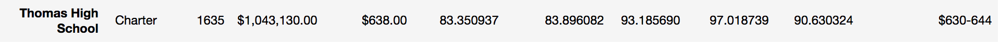
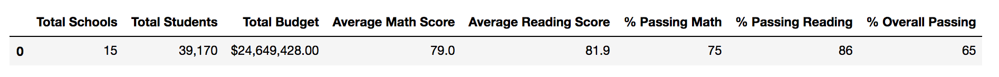
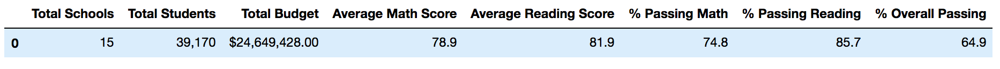

# School District Analysis

## Overview of Project
School district analysis on student's funding and standardized testing with the following task to complete.

1. Top 5 and bottom 5 performing schools, based on the overall passing rate.
2. The average math score received by students in each grade level at each school.
3. The average reading score received by students in each grade level at each school.
4. School performance based on the budget per student.
5. School performance based on the school size.
6. School performance based on the type of school

## Resources
- Data Sources: schools_complete.csv and students_complete.csv
- Software: Python 3.7 and Jupyter Notebook

## Results
* The district summary is affected by: The average math score has been changed. The percentage of math, reading and overall scores are changed as well. 
* The school summary is affected by: The percentage of overall passing has changed for each of three categories.
* How does replacing the ninth graders’ math and reading scores affect Thomas High School’s performance relative to the other schools?  Thomas High School is still on the top five high performance.
* Replacing the ninth graders’ math and reading scores did not affect the following:
  •	Math and reading scores by grade
  •	Scores by school spending
  •	Scores by school size
  •	Scores by school type
  

  
## Summary
The following four major changes in the updated school district analysis after reading and math scores for the ninth grade at Thomas High School have been replaced with Nans are:
* The average math score has changed from 79.0 to 78.9
* The percentage of passing math has changed from 75 to 74.8
* The percentage of passing reading has changed from 86 to 85.7
* The percentage of overall passing has changed from 65 to 64.9

  

